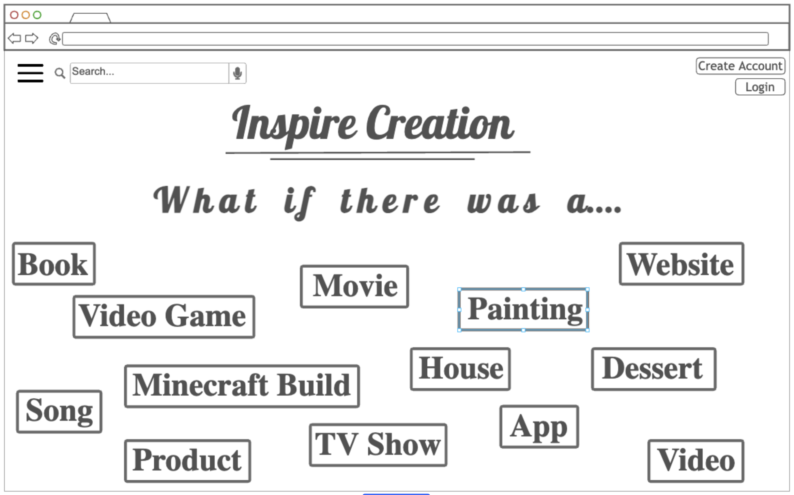
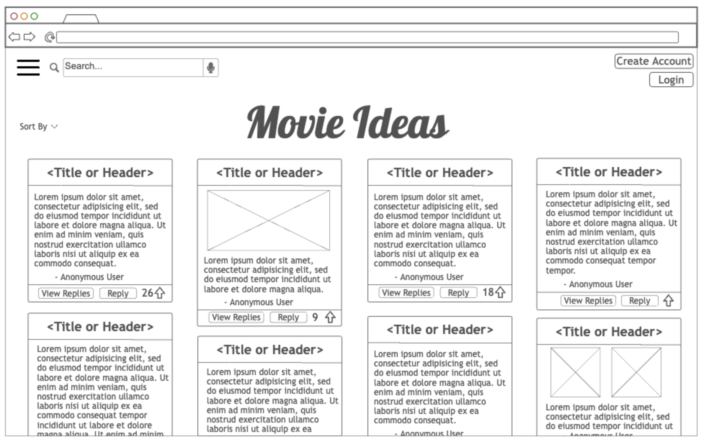

# Idea Share Website

## Specification Deliverable

### Elevator Pitch

Ideas are the world's most underutilized resource. Everyone has them,
but few actually know what to do with them. Maybe you have an idea 
for a book, movie, website, restaurant, or a video game, but you lack the 
time / money / skillset required to create it. And so, the idea dies, along
with its potential to become something greater than a passing thought. 
This idea sharing website allows you to easily record and publish your
ideas. Your posts are then made available to people around the world who 
can combine your inspiration with their skillset to build things you've 
only ever dreamed of.

### Design

### Key Features

* Secure login over HTTPS.
* Account creation and login with stored user profile data.
* Ability to create and publish idea posts with tags.
* Post data is stored and displayed to future users.
* Ability to filter posts based on tags.
* Ability for users to upvote posts they like and are interested in. 
* Ability for anyone to submit public replies to posts.
* Ability to send and receive direct messages between users.

### Technologies

I am going to use the required technologies in the following ways:
* HTML - Use correct HTML for the structure of my application. HTML pages
for account creation, login, creating posts, and viewing posts.
* CSS - Application styling that looks good on different screen sizes.
Uses good whitespace, coloring, and contrast to make each page look good.
* JavaScript - Handles dynamic content. Provides login, post display, upvoting 
posts, and replying to posts.
* React - Updating the viewing page with new posts, replies, upvotes.
* Web Service - Submitting posts, retrieving published posts, likes, replies,
direct messages, and sending direct messages.
* Database Data - Store post content, user profiles, and messages in a database.
User information (username, password) is stored securely in the database.
* WebSocket - As users publish posts, the posts are made available to be viewed
in real time by other users. Replies, upvotes, and direct messages are
also sent and displayed in real time.

## HTML Deliverable

For this deliverable, I built out the structure of my application using HTML.

- [x] **HTML pages** - Five HTML pages which represent the home/login page, and pages for viewing posts, creating posts, receiving direct messages, and sending direct messages.
- [x] **Links** - Each of the home, inbox, create post, and view posts links to each other. The inbox page has a link to the send message page.
- [x] **Text** - My home page includes a quote, and each page has textual labels to help guide the user.
- [x] **Images** - My image is featured on the home page (index.html) of my website.
- [x] **DB/Login** - Input box and submit button for login. The idea posts represent data pulled from the database.
- [x] **WebSocket** - The inbox page includes realtime messages displayed to the user. Users can also view and 'like' posts, all the data for which is displayed in realtime.

## CSS Deliverable

For this deliverable, I properly styles my application into its final appearance.

- [x] **Header, footer, and main content body** - All properly styled with css to create coherent and visually pleasing pages.
- [x] **Navigation elements** - Navigation bar is correctly styled, looks professional, and can be easily used to navigate the website.
- [x] **Responsive to Window Resizing** - Elements of pages adjust based on screen size to properly fit.
- [x] **Application Elements** - All elements on the web page are properly styled, including colors, font usage, and sizes for forms, text boxes, buttons, etc.
- [x] **Application Text Content** - All text content is properly styled, with good usage of font size and consistent font styles.
- [x] **Application Image** - All images are properly styled to fit on the webpage and adjust in size as needed.